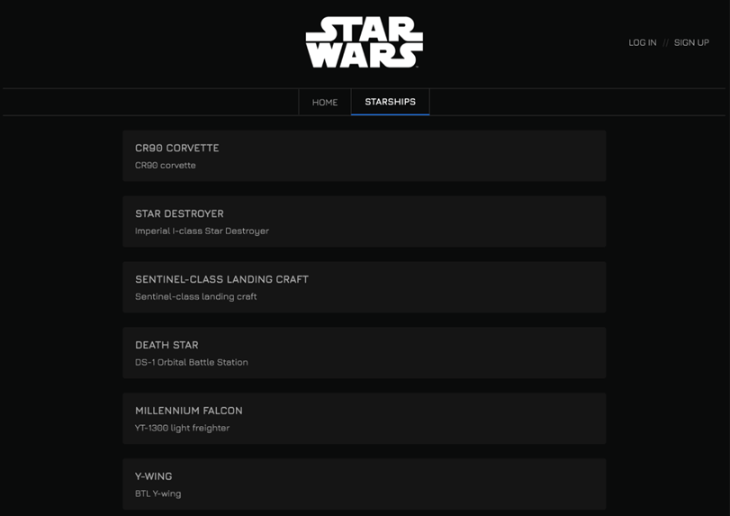
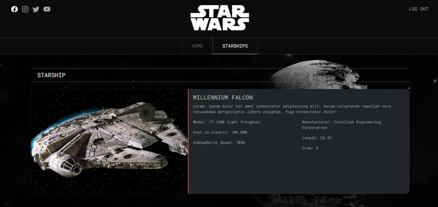
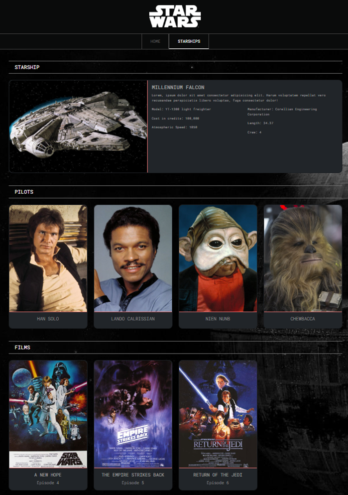

# Tasca S7. StarWars

## Descripció

En aquest exercici les dades seran llegides des d'un servidor.

Aquest lliurament està basat en una prova tècnica d'una gran empresa del sector e-commerce, que busca desenvolupadors/es front-end en la ciutat de Barcelona. La prova tècnica consisteix a: consumir les dades d'una API, mostrar-les en una pantalla a través d'un llistat i mostrar el detall de cada ítem del llistat.

La web que has de desenvolupar ha de mostrar informació sobre les naus de Star Wars! S'haurà de mostrar el llistat de naus amb la informació detallada de cada una d'elles.

## Informació de l'API a consumir

Per sort, aquesta API de Star Wars, ja està creada i ens servirà per obtenir el llistat de naus fàcilment.

(En qualsevol projecte professional, consumiràs dades d'una API. Per aquest motiu, és molt important entendre i saber com dur a terme els diferents mètodes per fer crides API i l'asincronisme de JavaScript.)

A continuació, et facilitem diferents enllaços i documentació per implementar correctament l'API:

[SWAPI- The Star Wars API-documentation](https://swapi.dev/documentation)

-Eina per provar crides API (un detall per part de swapi.dev):

[-> SWAPI- The Star Wars API](https://swapi.dev/)

En cas que no funcioni swapi.dev (a vegades les API gratuïtes poden no estar disponibles), utilitzar:

[-> SWAPI- The Star Wars API](https://swapi.py4e.com/)

## Endpoints útils

Les crides API que t'interessen són les següents:

- Obtenció del llistat de naus:

[-> swapi.dev](https://swapi.dev/api/starships)

Important: com s'ha esmentat anteriorment, si no funciona utilitzar:

[-> swapi.py4e](https://swapi.py4e.com/api/starships/)

- Obtenció del llistat de naus amb paginació (*):

[-> swapi.dev page=1](https://swapi.dev/api/starships/?page=1)

Modificant el número de pàgina aconseguiràs més naus.

- Pots utilitzar l'API "starwars-visualguide.com" per carregar les imatges de les naus. Un exemple de nau és:

[-> starwars-visualguide](https://starwars-visualguide.com/assets/img/starships/5.jpg)

Veuràs que els ids de "swapi.dev" i "starwars-visualguide.com" coincideixen.

(*) És important entendre el concepte de paginació, ja que és habitual que les API funcionin d'aquesta manera.

Generalment, és necessari evitar la sobrecàrrega d'una consulta executada en l'API, pel fet que, pot causar un timeout en la sol·licitud executada.

Com hauràs observat, si no indiquem el nombre de pàgines, el servidor no ens retornarà totes les naus, sinó que només retornarà 10. És a dir, hi ha un límit de devolució de nombre d'ítems per crides API.

A moltes API pots indicar-les la pàgina que vols i la quantitat d'ítems per pàgina que vols carregar. Recorda que sempre hi ha un límit superior d'ítems a carregar en una crida (en aquest cas swapi.dev està limitat a 10).

## Notes

- És molt recomanable utilitzar Redux en aquest sprint, ja que és molt sol·licitat en les entrevistes de treball. Aquest recurs et pot ajudar a acabar d'entendre-ho:

[-> Link Redux-Toolkit](https://medium.com/@diego.coder/implementando-redux-en-react-js-redux-toolkit-86b82219584a)

- Per aquesta pràctica ens agrada sempre recomanar una bona estructura d’un projecte de React:

[-> Link estructura projecte React](https://github.com/alan2207/bulletproof-react/blob/master/docs/project-structure.md)

## Nivell 1

### - Exercici 1

Per començar, el primer que has d'implementar és la pantalla principal on es visualitzi tot el llistat de naus.

Un cop implementat en el servidor, veuràs que aquest et retorna moltes dades interessants de cada nau, però en la pantalla principal només ensenyarem les dades més importants, per evitar una saturació de la informació.

Dades necessàries de cada producte (nau) en el llistat:

- Nom de la nau.

- Model.- Model.

Nota: No et preocupis de moment pels estils, els implementaràs més endavant. És preferible centrar-se primer a desenvolupar els components i la lògica, per després aplicar-li estils.

### - Exercici 2

En aquest exercici has de crear la fitxa de cada nau, mostrant tots els seus detalls.

L'usuari/ària podrà accedir als detalls de cada nau clicant en cadascuna d'elles a través del llistat.

Com pots veure, aquesta API malgrat ser gratuïta, és molt completa, ja que ens permet fer una web informativa de Star Wars molt interessant!

Igual que existeix aquesta API de Star Wars, existeixen moltes d'altres temàtiques, imagina la quantitat de webs variades que pots fer per millorar el teu portfoli!

### - Exercici 3

GENIAL!, ja tens una versió bàsica de la web creada, en la qual l'usuari/ària pot visualitzar el llistat de naus i, s'escau, observar la fitxa fent “clic”.

No obstant això, com hauràs pogut veure, encara tenim un límit de 10 naus per mostrar. Si t'hi fixes en la resposta de la crida API, veuràs indicat un total de 36 naus, les quals mostrarem a l'usuari/ària sota demanda.

Has d'implementar un botó al final del llistat de naus, amb el text "view more", que permeti obtenir més naus del servidor i s'agreguin al llistat de naus mostrades a l'usuari/ària.

❗ Importatant

Les crides d'API s'han de fer des de Context o Redux, no des dels components.

Bonus: és preferible implementar un scroll infinit, que carregui més naus a mesura que l'usuari/ària faci scroll de la web.

### - Exercici 4

Modernització del site. Canvia els estils que creguis pertinents. L'únic criteri és que s'assembli al màxim possible a la web oficial de Star Wars.

### - Exercici 5

Igual que hem fet en els lliuraments anteriors, implementarem una pàgina inicial de benvinguda, i mitjançant un botó, es podrà accedir a la pàgina principal de naus. Per això, has d'utilitzar el routing de React.

A més del botó d'accés en la pàgina principal, l'usuari/ària tindrà accés a la pàgina principal mitjançant la barra de navegació superior.

En el cas de no haver implementat encara el component, hauràs de crear la barra de navegació superior en un component separat.

### - Exercici 6

Ja gairebé has acabat la base del projecte! L'única cosa que et falta és la creació d’un Backend fake amb JSON server auth per gestionar usuaris/àries. 

Has d'implementar una pantalla de Login i Registre, fent servir una API senzilla (JSON-SERVER-AUTH o https://reqres.in/).

Requisits:

- Un usuari/ària no es pot registrar amb el mateix email.
- Un cop registra’t l’usuari/ària ha d'aparèixer logat.

Nota:  És molt recomanable usar https://reqres.in/, ja que es tracta d'una API amb usuaris fake, així practicaràs el login i registre com si es tractés d'una web real.

A més, convé que aprenguis a saber llegir documentació de Swagger, ja que estaherramienta s'usa en molts projectes

Si et decideixes per usar el paquet npm json-server auth:

[-> JSON Server Auth](https://www.npmjs.com/package/json-server-auth)

Exemple JSON-server-auth

[-> Exemple](https://dev.to/jyeett/the-basic-necessities-of-a-mock-user-authentication-with-json-server-auth-2onj)

## He usando Firebase Authentication

[-> Firebase Auth](https://firebase.google.com/docs/auth?hl=es)

### - Exercici 7

El llistat de naus només pot ser visible per usuaris/es registrats, has de protegir les rutes. 

Modificarem lleugerament l’aplicació, perquè en el cas que un usuari/ària no registrat vulgui accedir a un contingut protegit per un guard, el sistema li porti al “login”. Un cop fet el login correctament, s’ha de redirigir automàticament a la pàgina on volia accedir inicialment.

Tutorial:

[-> Rutes protegides amb React Router](https://www.youtube.com/watch?v=I-_3qGE6BkU&t=145s)

## Nivell 2

L’objectiu d’aquest nivell és arribar a crear l’apartat de pilots i de naus.

### - Exercici 8

En aquest exercici potenciarem la fitxa de cada nau mostrant les targetes dels seus pilots.

RECORDA que amb React utilitzem components, per tant, hauràs de crear un nou component per mostrar aquestes targetes dins del detall de nau i no t'oblidis de maquetar aquesta part nova!!

### - Exercici 9

Igual que has fet anteriorment, hauràs de mostrar les targetes de les pel·lícules en les quals ha aparegut la nau.

## Nivell 3

### - Exercici 10

ENHORABONA!, ja tens una web completa amb informació de les naus de Star Wars.

Atès que aquesta aplicació pot créixer més, per a preparar una bona base garantint que no apareixen bugs en un futur, hauràs d'implementar tests unitaris.

Crea tests unitaris per a almenys tres components.
